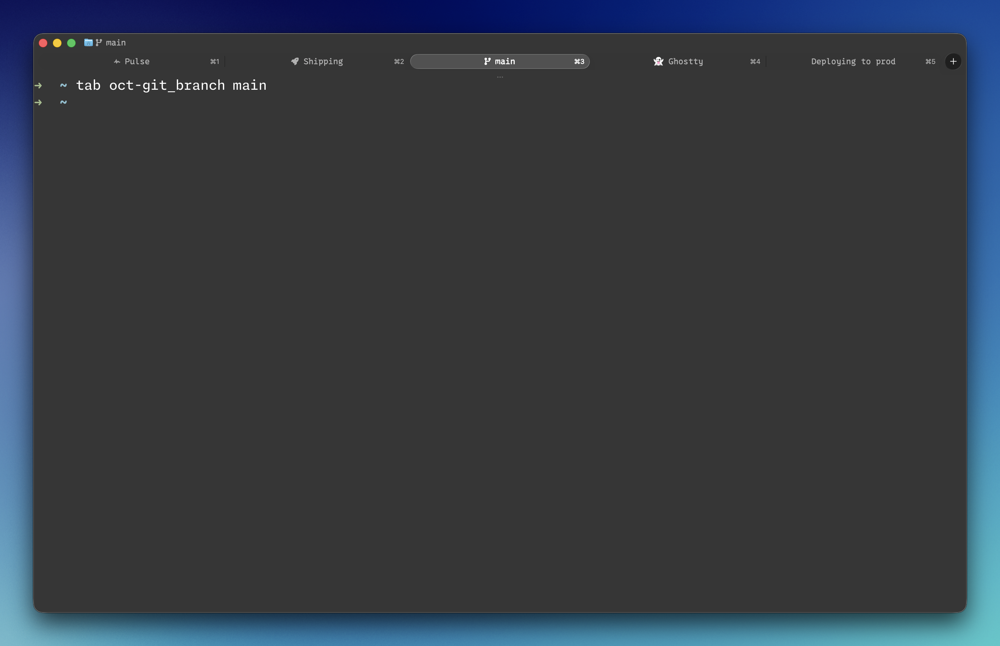

# tabglyph

**Put icons in your terminal tab titles — by name — and have them actually render in the macOS tab bar.**

```sh
tab fa-rocket Shipping      #  Shipping
tab md-pulse Pulse          # 󰐰 Pulse
tab oct-git_branch main     #  main
tab ghost Ghostty           # 👻 Ghostty
tab Deploying to prod       # plain text, no glyph
```

One `tab` command. ~10,000 searchable icons. Works in **Ghostty** tab labels on macOS — the place everyone says you can't theme.



---

## Why this exists

On macOS, terminal **tab labels are drawn by the OS in the system font**, which has no glyph at Font Awesome / Nerd Font Private-Use codepoints — so they render as tofu boxes (□). For a long time the accepted wisdom ([ghostty#5484](https://github.com/ghostty-org/ghostty/discussions/5484)) was that tab-title icons were impossible on macOS.

The breakthrough ([ghostty#9650](https://github.com/ghostty-org/ghostty/discussions/9650)): point Ghostty's **`window-title-font-family` at a single Nerd Font**. Because one Nerd Font file contains *both* the text letters *and* ~10k icons, the title renderer never has to cascade across fonts — and the glyphs render right in the tab labels.

tabglyph turns that into an ergonomic workflow: it reads the icon names baked into your installed Nerd Font and gives you a single `tab` command that takes icon names like `fa-rocket` or `md-pulse`.

## Requirements

- **macOS** with [Ghostty](https://ghostty.org) (the tab-label rendering trick is Ghostty + macOS).
- **zsh**
- A **[Nerd Font](https://www.nerdfonts.com)** installed (e.g. `0xProto Nerd Font`, `CommitMono Nerd Font`, `JetBrainsMono Nerd Font`).
- **python3** + **fonttools** (the installer handles fonttools for you).

> Font Awesome and emoji helpers are included too. Emoji also render in tab labels; Font Awesome Pro renders in *window* titles.

### Platform support

The `tab`, `nf`, `fa`, `em`, and `*-find` commands are plain zsh + `OSC 0` — they work in **any** terminal on **any** OS. A glyph shows up wherever the title is rendered in a font that contains it.

The *special* part — icons in the **macOS tab strip** — is the Ghostty + single-Nerd-Font trick this project is built around. On **Linux/GTK**, Ghostty tab titles are themeable via GTK CSS instead, and on other terminals your mileage varies. So: the tooling is cross-platform; the headline "icons in macOS tab labels" result is Ghostty-on-macOS.

## Install

### Quick install (recommended)

```sh
git clone https://github.com/butchewing/tabglyph.git ~/.tabglyph
~/.tabglyph/install.sh
```

The installer generates your icon tables, adds one `source` line to `~/.zshrc`, and prints the exact Nerd Font family name to use.

### Plugin managers

tabglyph is a standard zsh plugin. After installing via a manager, run **`tabglyph-gen`** once to build the icon tables from your fonts (the manager clones the repo but doesn't run the installer).

```sh
# zinit
zinit light butchewing/tabglyph

# antidote — add to ~/.zsh_plugins.txt
butchewing/tabglyph

# zplug
zplug "butchewing/tabglyph"

# oh-my-zsh — clone into custom plugins, then add `tabglyph` to plugins=(…)
git clone https://github.com/butchewing/tabglyph.git \
  "${ZSH_CUSTOM:-$HOME/.oh-my-zsh/custom}/plugins/tabglyph"
```

```sh
tabglyph-gen        # build/refresh icon tables (run once after install)
```

Then in your **Ghostty config** (`~/Library/Application Support/com.mitchellh.ghostty/config`):

```
window-title-font-family = 0xProto Nerd Font Propo   # use the name the installer printed
```

…and **fully quit & reopen Ghostty** (a config reload does not apply font changes). See [`examples/ghostty-config`](examples/ghostty-config).

### oh-my-zsh users

oh-my-zsh rewrites the tab title on every prompt, which clobbers your titles. Add this **above** `source $ZSH/oh-my-zsh.sh`:

```sh
DISABLE_AUTO_TITLE="true"
```

## Usage

### `tab` — the one command

```sh
tab <name> <label...>
```

If the first word is a known **Nerd Font** name (`fa-rocket`, `md-pulse`, `oct-git_branch`) or an **emoji** name (`ghost`, `rocket`), it becomes a leading glyph and the rest is the label. Otherwise the whole line is literal.

```sh
tab fa-server prod          #  prod
tab md-heart_pulse Pulse    # 󰗶 Pulse
tab tada Released           # 🎉 Released
tab Running tests           # literal text
tab "rocket science"        # quoted = forced literal (no emoji)
```

### Discovery

10k icons is a lot — search instead of memorizing:

```sh
nf-find pulse     # cod-pulse, fa-bed_pulse, md-heart_pulse, md-pulse, oct-pulse …
nf-find git       # every git-related glyph
em-find heart     # heart, heartbeat
```

### Glyph primitives

Print a single glyph (handy for prompts, scripts, or building titles by hand):

```sh
nf fa-rocket      # Nerd Font glyph (the set that renders in tab labels)
fa wave-pulse     # Font Awesome Pro glyph (window titles)
em ghost          # emoji
echo "$(nf oct-flame) build failed"
```

| Set | Glyph cmd | Search | Renders in tab labels? |
|-----|-----------|--------|------------------------|
| Nerd Font (~10k) | `nf` | `nf-find` | ✅ yes |
| Emoji (~50) | `em` | `em-find` | ✅ yes |
| Font Awesome Pro | `fa` | `fa-find` | ⚠️ window titles only |

### Naming notes

Two things trip people up — `nf-find` is the cure for both:

- **Underscores, not hyphens.** Nerd Fonts name multi-word icons with underscores: `fa-wave_square`, `md-heart_pulse`. tabglyph auto-retries the underscore form if you type Font Awesome's hyphen style (`fa-wave-square` just works), but the canonical names use `_`.
- **Font Awesome *free*, not Pro.** Nerd Fonts bundle the free Font Awesome set, so Pro-only icons (e.g. `wave-pulse`) aren't present — `tab` will warn and suggest a search. Look for an equivalent from another set (`nf-find pulse` → `md-pulse`, `oct-pulse`, `fae-pulse`). FA Pro glyphs still work in *window* titles via the `fa` helper.

## How it works

- **Icon names → codepoints.** Nerd Fonts name their glyphs meaningfully in the font's `cmap` (`fa-rocket`, `md-pulse`, `oct-git_branch`). `tabglyph-gen` reads those names straight from *your* installed font — no bundled icon database to drift out of date — and writes a zsh lookup table.
- **`tab` sets the title** with an `OSC 0` escape (`\033]0;…\007`).
- **Ghostty renders the title** using `window-title-font-family`; with a single Nerd Font there, the icon codepoints resolve and show in the tab strip.

### Regenerating after a font update

```sh
tabglyph-gen                        # auto-detect (function provided by the plugin)
tabglyph-gen --nerd-font CommitMono # pick a specific font
```

## Bonus: icons in the terminal *body*

The glyph primitives work anywhere, so you can drop icons into prompts, scripts, or output — not just titles:

```sh
echo "$(nf oct-flame) build failed"
PROMPT="$(nf dev-rust) %~ ❯ "
```

For these to render inline, your **terminal `font-family`** (the grid font, separate from the title font) needs the glyphs. Easiest path: make a Nerd Font your main font, or add one as a fallback entry — Ghostty supports a repeated key, and `font-codepoint-map` for per-range control ([ghostty#9787](https://github.com/ghostty-org/ghostty/discussions/9787)):

```
font-family = Your Coding Font
font-family = 0xProto Nerd Font   # fallback: supplies the icon glyphs
```

## The gotchas it solves

Hard-won during a very long debugging session:

1. The **title uses `window-title-font-family`**, not the terminal `font-family`.
2. A **single Nerd Font** is required — a multi-font fallback chain won't cascade Private-Use glyphs into macOS tab labels.
3. **Two things** overwrite titles each prompt: Ghostty's `shell-integration-features` `title` (set `no-title`) and oh-my-zsh's hook (`DISABLE_AUTO_TITLE="true"`).
4. Use **OSC 0**, not OSC 1.
5. Font changes need a **full app restart**, not a reload.

## References

The Ghostty discussions that made this possible (and that document the journey):

- [ghostty#5484](https://github.com/ghostty-org/ghostty/discussions/5484) — "tab titles can't be themed on macOS." The wall: macOS draws tab labels in the system font, so Private-Use glyphs tofu.
- [ghostty#9650](https://github.com/ghostty-org/ghostty/discussions/9650) — **the unlock.** A collaborator confirms `window-title-font-family` works on macOS, and a single Nerd Font renders icons in the tab titles.
- [ghostty#9787](https://github.com/ghostty-org/ghostty/discussions/9787) — multiple `font-family` entries, fallback **ordering**, and the `font-codepoint-map` setting (per-codepoint font control) — useful for icon glyphs in the terminal *body*, not just titles.

## Credits

- [Nerd Fonts](https://www.nerdfonts.com) for patching thousands of icons into coding fonts.
- [Ghostty](https://ghostty.org) by Mitchell Hashimoto, and the community in the threads above.

## License

MIT © Butch Ewing — see [LICENSE](LICENSE).
